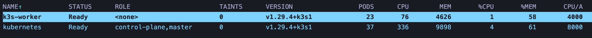
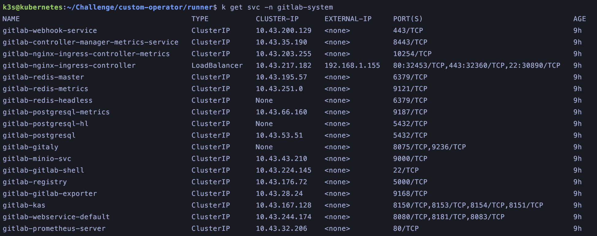
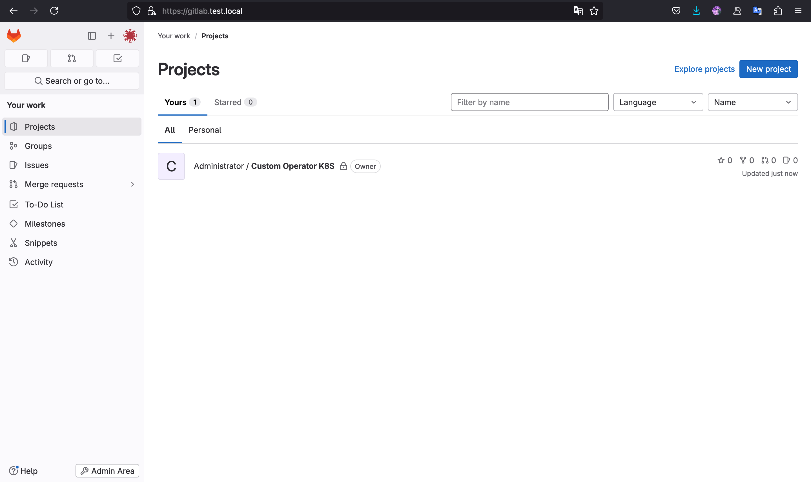
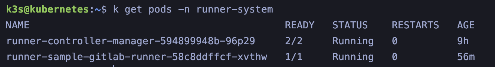
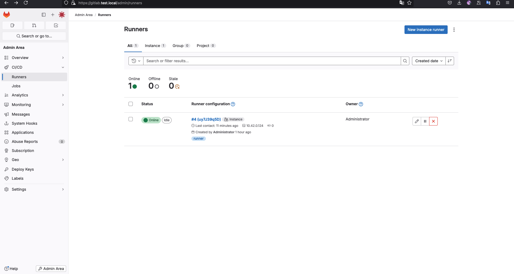

# custom-operator
In questa repository si implementa un custom gitlab runner operator configurato per fare il runner di una istanza gitlab che gira anche essa riconciliata da un operator.

## Installazione del cluster
Il deploy è avvenuto su **Proxmox**, utilizzando **telmate/proxmox** come provider per fare il deploy di una VM dentro l'istanza Proxmox. Come cluster **Kubernetes** è stata usato **K3S** in configurazione con un **master** e un **worker**.



Le risorse su Proxmox si presentano nel seguente modo


## Installare il classico gitlab operator

```bash
mkdir gitlab
cd gitlab
helm install gitlab-operator gitlab/gitlab-operator --create-namespace --namespace gitlab-system
```

Per vedere l'indirizzo IP associato all'istanza proxy

```bash
kubectl get services -n gitlab-system 
```



Creare la entry nel file /etc/host del cluster e della macchina da cui si vuole raggiungere l'istanza

echo "192.168.1.155	gitlab.test.local" >> /etc/hosts

Alla fine l'istanza GitLab apparirà così



Da qua è possibile creare nuove repository e pipeline.

Si dovrà poi aggiungere l' host sfruttando il DNS del cluster direttamente nella definizione della risorsa Runner

```yaml
hostAliases:
  - ip: "192.168.1.155"
    hostnames:
    - "gitlab.test.local"
```

In questo modo il runner conoscerà **gitlab.test.local** e considererà i suoi certificati come validi

Salvere i certificati da gitlab.test.local su file

```bash
openssl s_client -showcerts -connect test-gitlab.local:443 </dev/null 2>/dev/null|openssl x509 -outform PEM > gitlab.crt

openssl x509 -in gitlab.crt -text -noout
```

Creare il secret basato sul file crt di gitlab per verificare l'identità del server

```bash
kubectl create secret generic gitlab-cert -n runner-system --from-file=gitlab.crt
```

I certificati verranno letti definendo nella risorsa custom Runner il secret come volume montato sotto /etc/ssl/certs. In questo modo le richieste HTTPS tra il runner e gitlab possono avvenire anche con il certificato self signed.

```yaml
  volumeMounts:
          - mountPath: "/etc/ssl/certs/"
            name: gitlab-cert
            readOnly: true
  volumes: []
  volumes:
        - name: gitlab-cert
          secret:
            secretName: gitlab-cert
```

## Customizzare il runner tramite operator-sdk
Per questa parte del progetto ho scelto di creare un operatore basato su Gitlab Runner che incude nella definizione della risorsa la definizione del runner, gli host, i secret e i volumi.

```bash
mkdir runner
cd runner
operator-sdk init --plugins=helm --domain=gitlab.com --group=apps --version=v1beta1 --kind=Runner --helm-chart=gitlab/gitlab-runner
make install
export IMG=docker.io/blessedrebus/gitlab-runner:v0.0.1
make docker-build docker-push IMG=$IMG
make deploy IMG=$IMG
```

La risorsa runner sarà presentata come segue

```yaml
apiVersion: apps.gitlab.com/v1beta2
kind: Runner
metadata:
  name: runner-sample
spec:
  affinity: {}
  checkInterval: 3
  concurrent: 10
  configMaps: {}
  deploymentAnnotations: {}
  deploymentLabels: {}
  deploymentLifecycle: {}
  extraEnv: {}
  extraEnvFrom: {}
  extraObjects: []
  hostAliases:
  - ip: "192.168.1.155"
    hostnames:
    - "gitlab.test.local"
  image:
    image: gitlab-org/gitlab-runner
    registry: registry.gitlab.com
  imagePullPolicy: IfNotPresent
  gitlabUrl: "https://gitlab.test.local"
  runnerRegistrationToken: "glrt-uy7J39q5DLuR_Xzcgzjm"
  unregisterRunners: true
  metrics:
    enabled: false
    port: 9252
    portName: metrics
    serviceMonitor:
      enabled: false
  nodeSelector: {}
  podAnnotations: {}
  podLabels: {}
  podSecurityContext:
    fsGroup: 65533
    runAsUser: 100
  priorityClassName: ""
  rbac:
    clusterWideAccess: false
    create: false
    generatedServiceAccountName: ""
    imagePullSecrets: []
    podSecurityPolicy:
      enabled: false
      resourceNames:
      - gitlab-runner
    rules: []
    serviceAccountAnnotations: {}
  resources: {}
  runners:
    cache: {}
    config: |
      [session_server]
        session_timeout = 1800
      [[runners]]
        name = "gitlab-runner-test"
        url = "https://gitlab.com"
        id = 38659274
        token = "glrt-dE28onWfj5m2MdRMypPg"
        executor = "kubernetes"
        [runners.custom_build_dir]
        [runners.cache]
          MaxUploadedArchiveSize = 0
          [runners.cache.s3]
          [runners.cache.gcs]
          [runners.cache.azure]
        [runners.kubernetes]
          host = ""
          bearer_token_overwrite_allowed = false
          image = ""
          namespace = ""
          namespace_overwrite_allowed = ""
          namespace_per_job = false
          node_selector_overwrite_allowed = ""
          node_tolerations_overwrite_allowed = ""
          pod_labels_overwrite_allowed = ""
          service_account_overwrite_allowed = ""
          pod_annotations_overwrite_allowed = ""
          [runners.kubernetes.init_permissions_container_security_context]
            [runners.kubernetes.init_permissions_container_security_context.capabilities]
          [runners.kubernetes.build_container_security_context]
            [runners.kubernetes.build_container_security_context.capabilities]
          [runners.kubernetes.helper_container_security_context]
            [runners.kubernetes.helper_container_security_context.capabilities]
          [runners.kubernetes.service_container_security_context]
            [runners.kubernetes.service_container_security_context.capabilities]
          [runners.kubernetes.volumes]
          [runners.kubernetes.dns_config]
    configPath: ""
  secrets: []
  securityContext:
    allowPrivilegeEscalation: false
    capabilities:
      drop:
      - ALL
    privileged: false
    readOnlyRootFilesystem: false
    runAsNonRoot: true
  service:
    enabled: false
    type: ClusterIP
  serviceAccount:
    annotations: {}
    imagePullSecrets: []
    name: ""
  sessionServer:
    enabled: false
  shutdown_timeout: 0
  strategy: {}
  terminationGracePeriodSeconds: 3600
  tolerations: []
  topologySpreadConstraints: {}
  useTini: false
  volumeMounts:
          - mountPath: "/etc/ssl/certs/"
            name: gitlab-cert
            readOnly: true
  volumes: []
  volumes:
        - name: gitlab-cert
          secret:
            secretName: gitlab-cert
```

Infine si applica la CRD con

```bash
k apply -f crd.yaml -n gitlab-system
```

Una volta installato l'operatore nuovo le risorse si presenteranno così



Sull'istanza GitLab apparirà nel seguente modo




